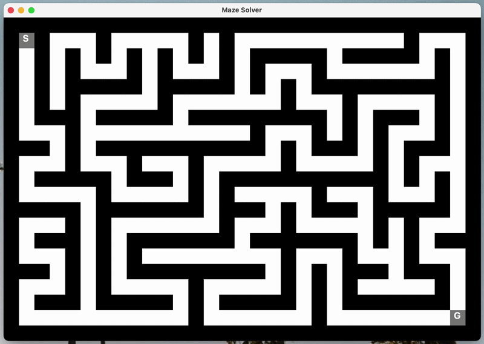

# maze-generator-solver
Java program that generates a random maze, usingDFS, and solves it, using BFS. 

## General Features
- Random maze generating using DFS
- Maze solving using BFS
- Console visualization

## Maze Generation Algorithm
The maze is generated using DFS algorithm recursivly. 
This algorithm produces a **Perfect Maze**, meaning:
- All cells in the maze are connected
- There are no loops
- There is exactly one unique path between any two cells

## Basic Assumptions 
- **Maze dimensions** are determined by the user, and must be odd numbers. this is required because the algorithm treats cells and walls differently - actual maze cells apear at odd indices, walls apear between tham. 
- **start and goal** are set automatically. start is at the top-left corner, and goal is at the bottom-right corner.

## Demo 

    

